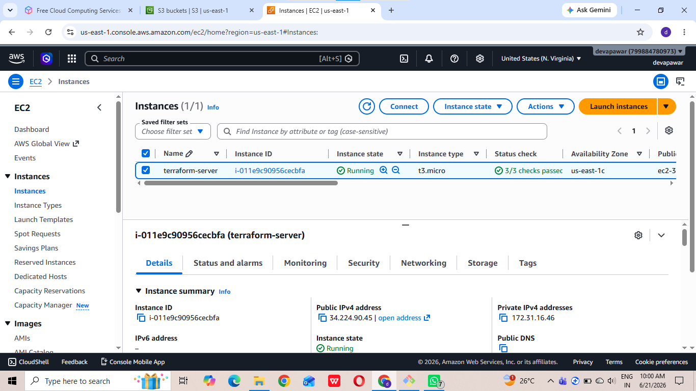
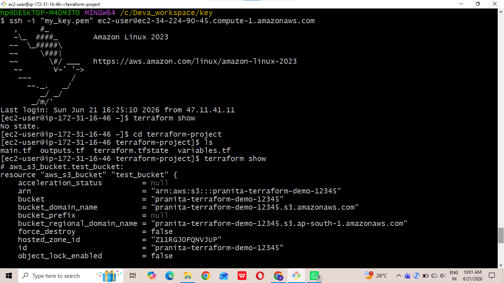
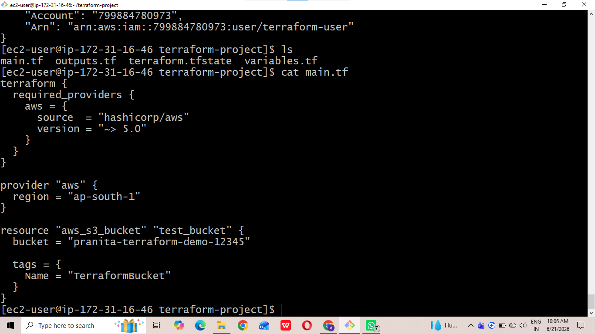
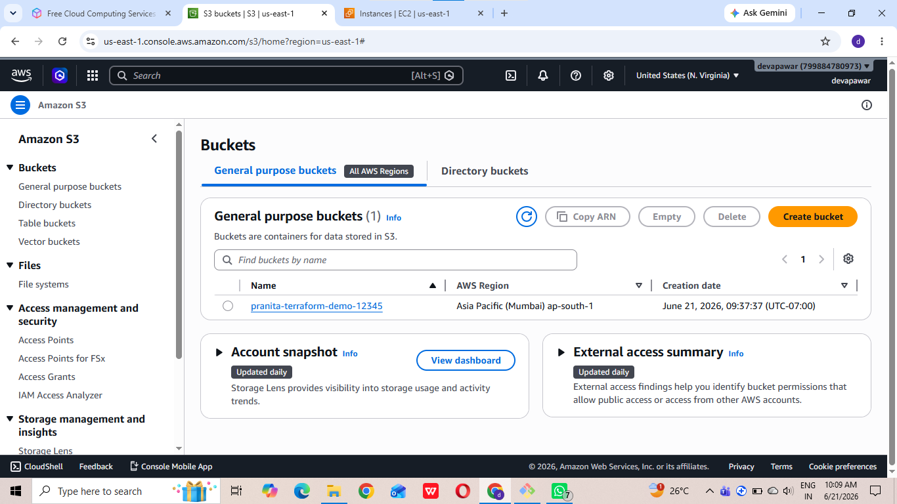
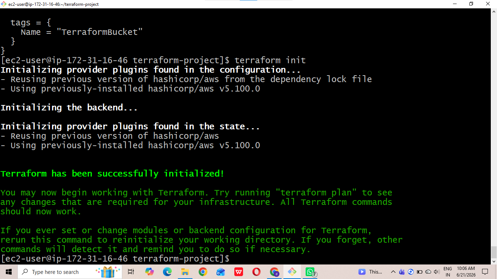
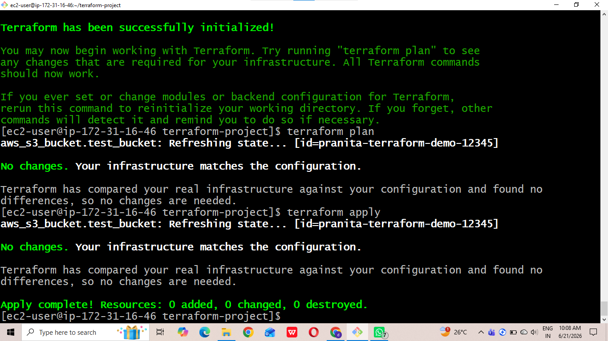

# 🚀 Project Completed: Multi-Environment Infrastructure Design using Terraform Workspaces

## Project Overview
In this project, I implemented a multi-environment AWS infrastructure using a single Terraform codebase. The goal was to separate Development, Staging, and Production environments while ensuring infrastructure consistency, scalability, and code reusability.

## Key Steps

• Created Terraform Workspaces for Dev, Staging, and Production

• Provisioned AWS EC2 instances for each environment

• Configured Security Groups with environment-specific rules

• Created and managed AWS S3 bucket resources

• Used variables and reusable Terraform modules

• Implemented remote state management using S3 backend

• Validated environment isolation and resource separation

## Technologies Used

Terraform | AWS EC2 | AWS S3 | VPC | Security Groups | Terraform Workspaces | Infrastructure as Code (IaC)

## step-by-step setup Guide
### STEP 1: first of all i had create ec2 instance

### STEP2: Create a security group 
### STEP3: terraform workspace
 
 ### STEP4: main.tf file

### Step5: aws s3 bucket

### STEP6: terraform init

### STEP7:terraform apply

## Project Outcome

This project helped me understand Infrastructure as Code, Terraform Workspaces, environment isolation, reusable modules, and AWS resource management. It also provided hands-on experience with managing multiple environments from a single codebase.

# 📌 Key Learning:
Managing Dev, Staging, and Production environments efficiently using Terraform while maintaining security, scalability, and code reusability.

#Terraform #AWS #DevOps #CloudComputing #InfrastructureAsCode #TerraformWorkspaces #EC2 #S3
